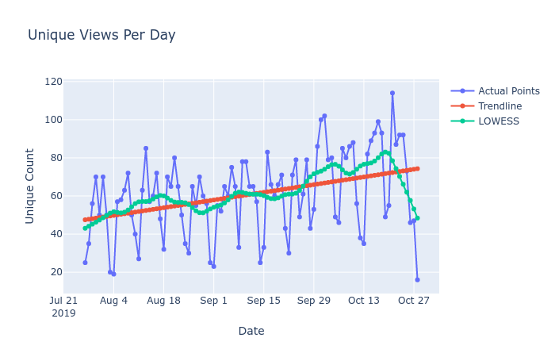

# Ncappzoo Analysis Tool



## Includes:

1. `database_constructor.py`: Python Script for Generating JSON and CSV Files
2. `Graph_Visuals.ipynb`: Jupyter Notebook for Visualizing Trends in Data

## Requirements for the Python Script

- Numpy
- Pandas
- Plotly
- Scikit-Learn
- Scipy
- Statsmodels
- PyGithub

### Command to Install Required Packages
```
$ sudo pip3 install numpy pandas scikit-learn scipy statsmodels PyGithub
```

## Using scripts to build database
`database_constructor.py` or `database_constructor-v2.py` <br/> <br/>
Parameters: <br/>
`-u`: username <br/>
`-p`: password <br/>
`-oc`: path to a reference table for clones <br/>
`-ov`: path to a reference table for views <br/>
<br/>
Output:
- outputs json and csv files for current data pulled from github
- outputs csv file that builds upon reference file using current data

*Note: v2 uses PyGithub, which grabs the json data using requests rather than curl*

## Viewing Graph Trends
`Graph_Visuals.ipynb`

### Steps:
1. Initiate Jupyter Notebook environment in terminal
2. Click on the file within the UI that pops up in a browser
3. Edit the `viewsfile` and `clonesfile` variable to be the paths to the csv files that you want to illustrate via plotly.

### What you see:
- Plot of actual data
- Plot of Simple Regression line
- Plot of LOWESS line
- Ability to zoom in and zoom out on certain parts of data
- Ability to download a png image of the graph to use elsewhere
